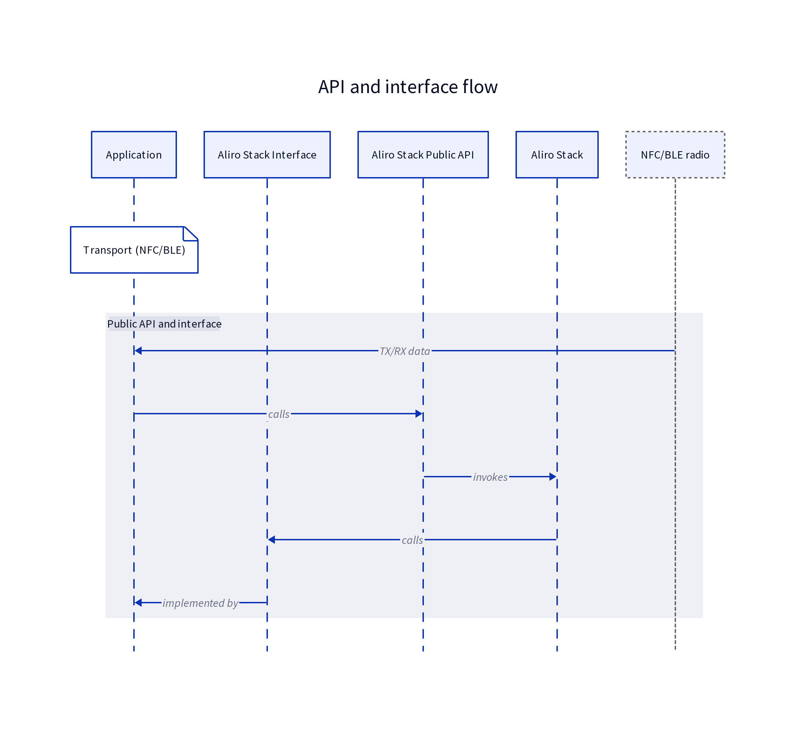
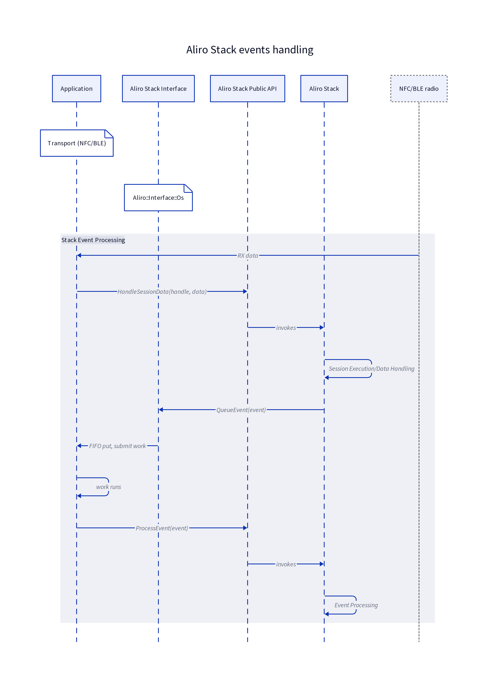
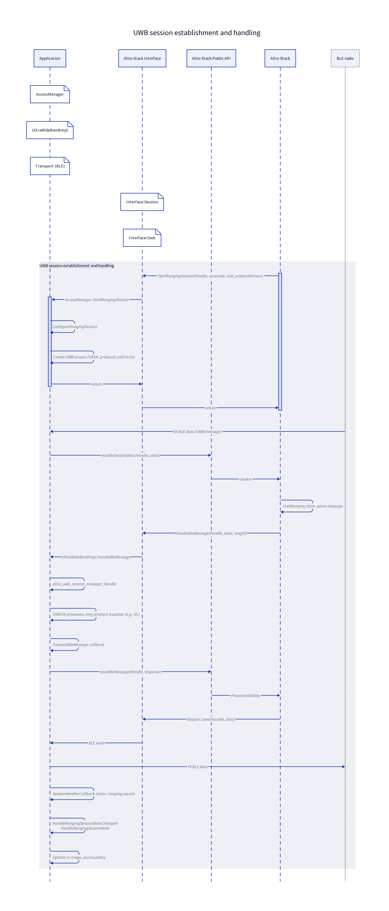

.. _aliro_application_interactions:

Aliro application interactions
##############################

.. contents::
   :local:
   :depth: 2

The following page describes how the application code can interact with the Aliro stack implementation, and shows examples of specific interaction flows.
It applies to all Aliro-enabled applications in the |REPO_NAME| (standalone and Matter + Aliro).
Matter stack interaction is out of scope here.

For static architecture, the stack library location, and where interfaces are implemented, see :ref:`aliro_integration`.
For access policy and lock actions, see :ref:`aliro_access_manager`.
For transport backends, see :ref:`nfc_integration`, :ref:`aliro_ble_transport`, and :ref:`uwb_integration`.

Diagram conventions
*******************

This section explains the components and layers shown in the interaction diagrams and how responsibilities are divided between the application, the Aliro stack, and the underlying hardware:

* Application – Represents the application-layer code that owns policy decisions and platform-specific behavior.
  It implements the interfaces defined by the Aliro stack and uses the Aliro Stack Public API to interact with the stack.
  Concrete interface implementations live in :file:`applications/*/src/aliro/interface_impl/`.
* Access Manager – Application module that maps stack access outcomes to lock actions and UWB ranging policy.
  See :ref:`aliro_access_manager`.
* Aliro Stack Interface – Represents the set of interfaces defined by the Aliro stack and implemented by the application, such as ``Interface::Os``, ``Interface::Access``, ``Interface::CredentialIssuerCertificate``.
  The Aliro stack calls these interfaces, and the application provides their concrete implementations.
* Aliro Stack Public API – Represents public API defined by the Aliro stack.
  It serves as the entry point through which the application interacts with the Aliro stack.
* Aliro Stack – Represents the protocol engine that implements session management, internal state machines, data security, and Aliro protocol logic.
  It defines both the public API (entry points for the application) and the interface contracts (callbacks and services the stack requires).
* NFC and Bluetooth LE Radio (NFC/BLE) – Represents the hardware component that performs the physical transmission and reception of Aliro session data.

.. list-table:: Common stack interfaces (implemented by the application)
   :header-rows: 1
   :widths: 35 65

   * - Interface
     - Role
   * - ``Interface::Os``
     - Timers, work queueing, and event delivery to the application.
   * - ``Interface::Access``
     - Access Document parameters and credential verification hooks.
   * - ``Interface::Session``
     - Session lifecycle, including Bluetooth LE send and UWB ranging session start.
   * - ``Interface::Uwb``
     - Vendor UWB stack integration for Aliro over UWB control messages.
   * - ``Interface::Crypto``
     - Cryptographic primitives.
   * - ``Interface::Reader``
     - Reader identity and certificate provisioning.
   * - ``Interface::CredentialIssuerCertificate``
     - Credential Issuer certificate validation.
   * - ``Interface::AccessDocument``
     - Access Document validity verification.
   * - ``Interface::Ble``
     - Bluetooth LE transport integration.
   * - ``Interface::Logging``
     - Platform logging for stack messages.

High-level design: Layers and interface contract
************************************************

This section describes the high-level layering of the |APP_NAME| and the direction of calls between the Application, the Aliro Stack, and the underlying radio.
It shows how responsibilities are separated and how the public API and stack-defined interfaces are used.

   Public API and interfaces flow.

The workflow is as follows:

* The NFC/Bluetooth LE Radio performs TX/RX.
  The Application (which includes the transport abstraction and other hardware-specific code) receives data from the radio and delivers it to the Aliro Stack through the Aliro Stack Public API.
  The stack is the only component that interprets protocol and session state.
  For session data, the Application acts as the data pipe between NFC/Bluetooth LE Radio and the stack.
* The Application is the caller of the Aliro Stack Public API.
  It invokes the stack to start sessions, process events, and drive protocol.
  The Public API is defined and implemented entirely within the Aliro Stack.
* When the Aliro Stack needs OS services, access decisions, or cryptographic operations (for example, queueing work, requesting Access Document parameters, verifying certificates), it calls the Aliro Stack Interface.
  The interfaces are defined by the Aliro Stack and implemented by the Application.
  The stack remains application-agnostic, as all platform-specific behavior lives in the Application implementation of these interfaces.

Layers are clearly separated.
The Application uses the Aliro Stack Public API to drive the Aliro Stack and implements the stack-defined interfaces.
The Application (transport, crypto, and other hardware and platform code) carries session data between NFC/Bluetooth LE Radio and stack, and provides crypto and platform services.
The Aliro Stack defines both the public API and the interface contracts.
It never contains application logic, only calls into the Application through the Aliro Stack Interface.

Stack events processing
***********************

The |APP_NAME| processes stack events on a dedicated Zephyr work queue.
When the Aliro Stack notifies the Application through the ``Interface::Os::QueueEvent`` callback, the Application implementation queues the event into Zephyr FIFO and submits a work item to the Aliro work queue.

Some operations, such as preprocessing transport data and managing the Aliro session, are performed directly in the caller's (Application) context rather than on the dedicated work queue.
The dedicated work queue runs a single thread named ``aliroworkq``.
Its work handler drains the FIFO and calls the Aliro Stack Public API ``ProcessEvent()`` for each queued event.
As a result, all stack event processing within the application runs on this single thread.
Other Aliro-related work, such as ``Interface::Os`` timers, is also submitted to the same queue using ``AliroWorkqueueSubmit()`` and ``AliroWorkqueueReschedule()``.
This design ensures that the stack never blocks in the caller's context and that all work items are dispatched on the ``aliroworkq`` thread.

The Aliro Stack may invoke application callbacks from different contexts.
The FIFO and work-queue submission mechanism keep the stack non-blocking while ensuring that events are processed in order on the dedicated thread.

The following diagram shows how session data flows from reception, through stack-driven event processing, and back to the application.

   Stack event processing.

The workflow is as follows:

* The NFC/Bluetooth LE Radio receives data and passes it to the Application.
  The Application's Transport implementation delivers the payload to the Aliro Stack through ``HandleSessionData()`` public API function.
  The stack then executes the internal session state machine logic to interpret the data and update session state.
  For session data, the Application does not interpret protocol, but it forwards data to the stack.
* When the Aliro Stack must notify the Application about an event (for example, session data received, session ended), it calls ``Interface::Os``, which is defined by the stack and implemented by the Application.
  The implementation queues the event into a FIFO and submits work, so the stack can return without blocking.
  The stack does not know how the Application schedules or prioritizes work.
  It only calls the corresponding interface.
* When the Application's work runs, it calls the Aliro Stack Public API ``ProcessEvent()`` function to hand the event back to the Aliro Stack.
  The stack then performs event processing (state updates, further interface calls, or session actions).

Session data flows as follows: NFC/Bluetooth LE Radio → Application (Transport) → Aliro Stack through public API.

The Application provides Transport and other platform abstractions.
The Aliro Stack turns received data into events and delivers them through ``Interface::Os``.
The Application queues and schedules work, then drives the stack through ``ProcessEvent()`` from the Aliro Stack Public API.
This keeps the stack non-blocking and leaves scheduling and queuing policy in the Application.

UWB session establishment and handling
**************************************

This diagram shows how an Ultra Wideband (UWB) ranging session is established and handled when Bluetooth LE or UWB transport is enabled.
For platform integration and QM35 defaults, see :ref:`uwb_integration`.

   UWB session establishment and handling.

The workflow is as follows:

* When the Aliro Stack enters the ``UwbRanging`` state (after Bluetooth LE session setup), it calls the ``StartRangingSession()`` function on the ``Interface::Session`` interface from the Aliro Stack Interface.
  The application's ``AccessManager`` creates a ranging session context and calls ``UltraWideBandInstance().ConfigureRangingSession()``.
  This creates the UWB session in the platform UWB implementation. For example, the Qorvo QM35 example implementation uses the Qorvo UWB library.
  The stack does not manage UWB session objects.
  The Application and its UWB implementation own them.
* UWB setup and control messages (for example, M1/M2 and other Aliro UWB protocol messages) are carried over Bluetooth LE Transport.
* When the Bluetooth LE radio receives data from the User Device, the Application delivers it to the Aliro Stack through ``HandleSessionData()``.
  The stack then parses the message and calls the ``HandleBleMessage()`` function on the ``Interface::Uwb`` interface from the Aliro Stack Interface.
* The Application UWB implementation passes the payload to the vendor UWB stack.
  The stack generates a response.
  The ``mBleMessageTransmit`` callback invokes the ``SendBleMessage`` public API from the Aliro Stack Public API.
  The stack then sends the response over Bluetooth through the ``Send()`` function on the ``Interface::Session`` interface from the Aliro Stack Interface.
* The Application Bluetooth LE transport transmits the payload to the User Device.
  This request and response cycle continues until the UWB session is fully set up.
* Once the UWB session is active, the UWB implementation reports session state changes and ranging measurements through the callbacks registered in ``UltraWideBand::Init()``.
  The Application maps these to ``AccessManager`` handlers (for example, ``HandleRangingSessionStateChanged``, ``HandleRangingSessionData``).
  The ``AccessManager`` uses this information for access policy (for example, in-range detection and access decisions).

To establish a UWB session, the Aliro Stack requests session creation through ``Interface::Session::StartRangingSession``.
The Application configures the UWB session through ``UltraWideBandInstance()``.
UWB setup messages are exchanged over Bluetooth LE - the stack receives data through ``HandleSessionData`` and forwards the processed data to the Application as events.
The Application uses the vendor UWB stack and sends responses back through the Aliro Stack Interface.
Ranging state and distance data is delivered from the UWB implementation to the ``AccessManager``, so the Application can enforce access policy based on UWB ranging.

To learn how to integrate a UWB module from a vendor other than Qorvo, see the :ref:`uwb_custom_integration` documentation page.
